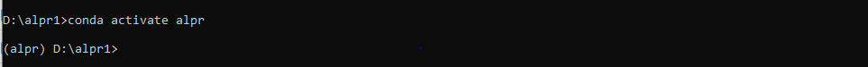
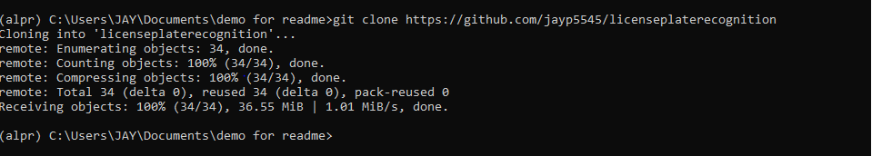
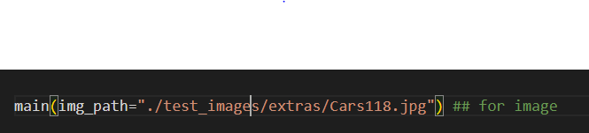
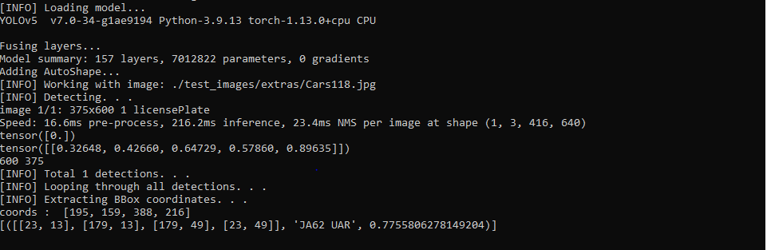

# Automatic License Plate Recognition

This project aims to detect and the recognize the license plate characters using Python and EasyOCR 


## References

 - [Yolov5 Github](https://github.com/ultralytics/yolov5)
 - [Creating custom yolov5 model](https://towardsdatascience.com/how-to-train-a-custom-object-detection-model-with-yolo-v5-917e9ce13208)
 - [EasyOCR](https://github.com/JaidedAI/EasyOCR)


## Installation

### Step 1: Install anaconda environment

The first step for installing Anaconda on your computer is to download the installation file from the Anaconda website. You can do this by visiting https://www.anaconda.com/products/distribution, selecting the version of Anaconda you want to install, and clicking the "Download" button. Once the file is downloaded, you can then follow the instructions to install Anaconda on your system.

### Step 2: Setting up a conda environment

The second step after installing Anaconda could be setting up a conda environment for your project. To do this, you can use the following command in your terminal or command prompt:

```bash
conda create --name alpr
```
Replace "alpr" with the name you want to give to your environment. This will create a new conda environment with the specified name.

Next, you can activate the environment using the following command:
```bash
conda activate alpr   
```

To deactivate a conda environment, you can use the following command in the terminal or command prompt:
```bash
conda deactivate
```

### Step 3: Cloning the project 

1.To clone the project you can use the following commnand in the cmd:
```bash
 git clone https://github.com/jayp5545/licenseplaterecognition
```
 

2.Change the directory to the alpr 

```bash
cd alpr
```

### Step 4: Installing easyOCR
Make sure you have Python and pip (the package manager for Python) installed on your machine. You can check if Python is installed by running the following command in the terminal or command prompt:
```bash
python --version
```
Install the required packages by running the following command:

```bash
pip install torch torchvision torchaudio
pip install opencv-python 
```
Install EasyOCR by running the following command:
```bash
pip install easyocr
```

## Running Program

You can then open the program file deploy.py in your choice of code editor and change the paths of test files.

To run specific images do the following: 

To check for images go to the last line and edit the path accordingly.



Then you can run the program in the conda environment by the following command:

```bash
python deploy.py
```

## Results 


